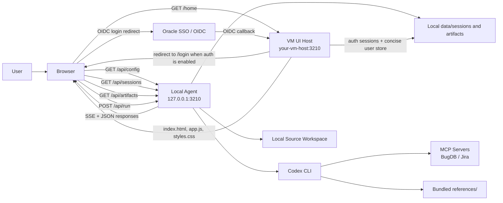
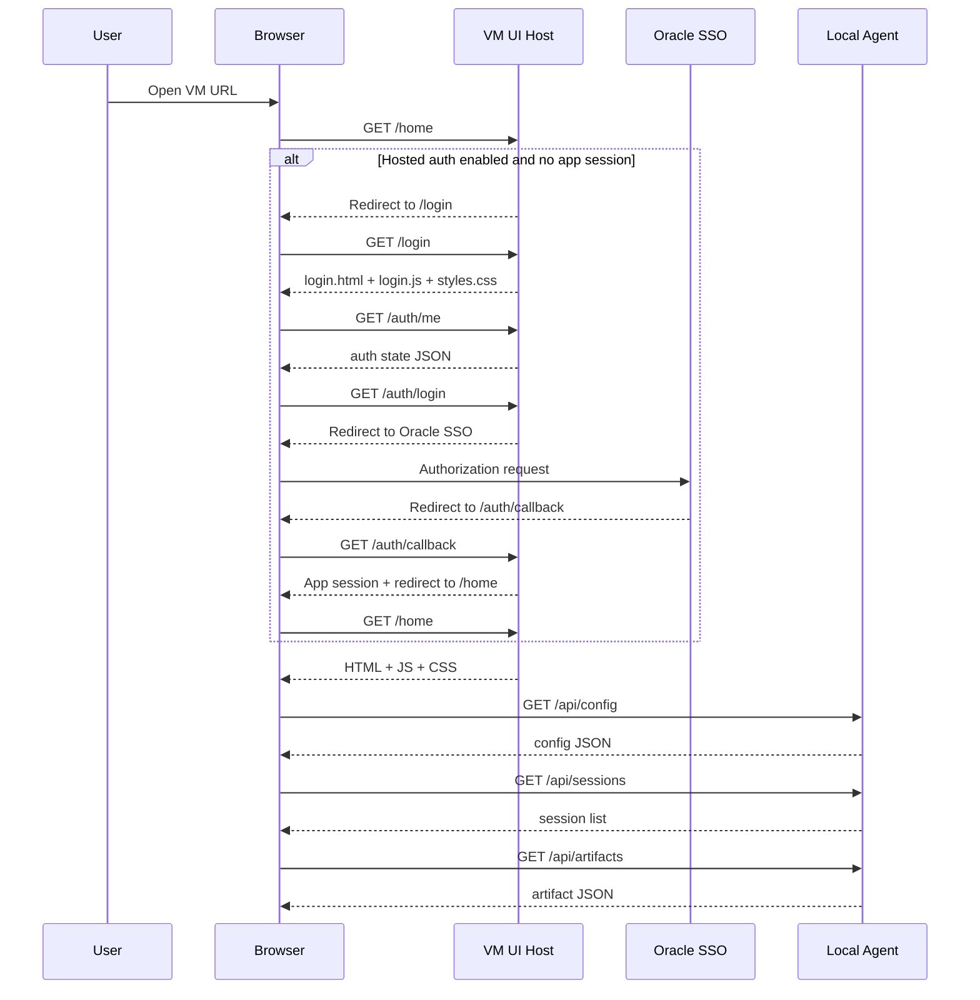
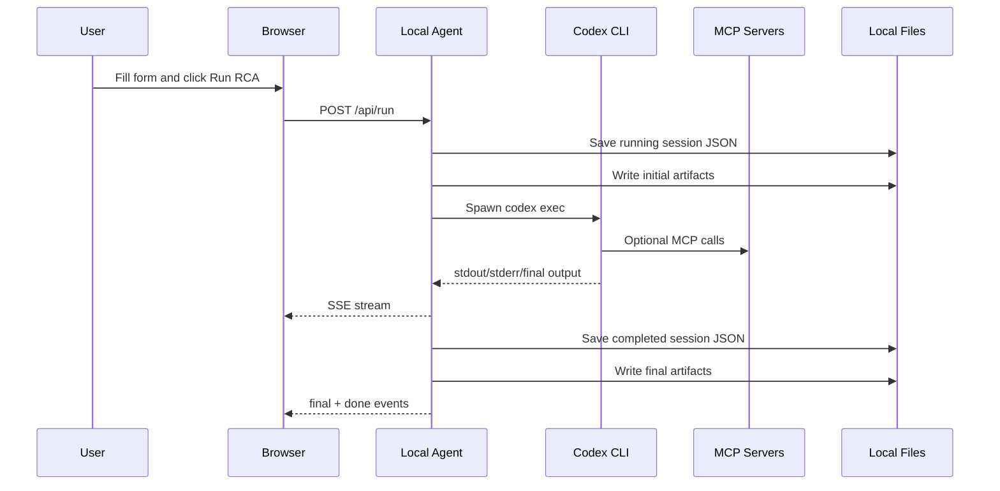
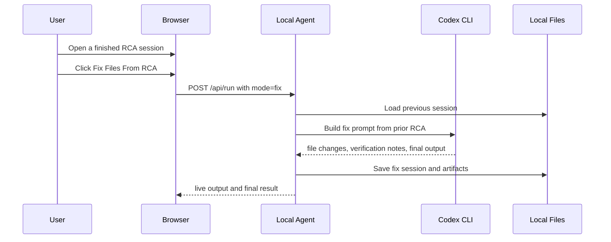

# Bug RCA UI Architecture

This document explains the tool in full detail so it can be demonstrated clearly to users, admins, managers, and reviewers.

## 1. Executive Summary

This tool supports two execution patterns:

- a **hosted browser UI / hosted server runtime** that can run on a VM such as `your-vm-host`
- a **local execution agent** that can run on each user's machine for direct local or UNC workspaces

The UI is the presentation layer.

Execution can happen either on the VM or on the user machine, depending on the workspace type.

For direct local folders and UNC paths, the local agent is the component that:

- launches Codex
- reads the local source workspace
- talks to MCP servers such as BugDB or Jira
- stores sessions and artifacts
- streams RCA and fix output back into the browser

For hosted shared workspaces such as `shared://simphony`, the VM runs Codex itself in hosted `combined` mode.

That is the most important thing to understand.

## 2. Core Design Goal

The tool is designed so that:

- users can open one shared URL
- the browser UI can be centrally hosted on a VM
- hosted shared workspaces can execute directly on the VM
- direct local workspaces can still execute on the user's own machine
- the user's local workspace does not need to be copied to the VM

## 3. One-Sentence Mental Model

When a user opens the VM URL, the VM gives them the UI; then execution happens either on the VM for hosted `shared://...` workspaces or on the user's local agent for direct local/UNC workspaces.

## 4. High-Level Architecture



## 4.1 Hosted Authentication Layer

When Oracle SSO is enabled, the VM-hosted UI becomes the authentication gate for the browser UI.

That means:

- unauthenticated users are redirected to `/login`
- `/auth/login` starts the OIDC authorization-code flow
- `/auth/callback` completes sign-in and creates the app session
- `/auth/me` returns current authentication state to the login page and app shell
- `/auth/logout` clears the local app session and optionally redirects to the configured logout target

This authentication layer protects the hosted UI.

It does **not** move Codex execution to the VM.

The hosted UI server stores concise auth data in JSON and mirrors it into:

- `data/auth-login-details.xlsx`

That workbook is derived from the JSON auth stores and excludes password hashes and similar secrets.

The local-agent architecture stays the same after sign-in.

## 5. Runtime Modes

The project supports three runtime modes:

- `combined`
  The UI and execution API are on the same machine.
- `agent`
  Only the execution API runs. This is the local agent mode.
- `ui`
  Only the browser UI is hosted. This is the VM-hosted mode.

For the current hosted Simphony deployment:

- the VM runs `combined` for hosted `shared://simphony`
- each user machine only needs the separate local agent when it intentionally uses a direct local or UNC workspace

## 6. What Runs Where

### On the VM

The VM hosts:

- static browser UI
- HTML shell
- frontend JavaScript
- frontend CSS
- hosted `shared://...` workspace APIs
- Codex execution for hosted shared workspaces in `combined` mode
- hosted sessions and artifacts for those shared runs

The VM does **not** host:

- the user's direct local workspace
- the user's local-agent runtime for local or UNC workspaces

### On the User Machine

The user machine hosts:

- local agent HTTP server
- Codex CLI execution
- access to the user's source workspace
- saved session files
- RCA and fix artifacts
- MCP access if configured locally

## 7. Network Model

There are two different HTTP targets in the final solution.

### Target 1: VM UI Host

Example:

```text
http://your-vm-host:3210/home
```

This returns the UI.

### Target 2: Local Agent

Example:

```text
http://127.0.0.1:3210
```

This is where the browser sends runtime API requests.

The primary listeners are:

- VM hosted server: `your-vm-host:3210`
- user machine local agent: `127.0.0.1:3210`

## 8. Startup Flow

### VM Startup

The VM runs:

```text
start-server.cmd
```

This starts the server in hosted `combined` mode. `start-server.cmd` keeps the hosted server in the current console window.

For persistent Windows VM hosting, the bundle also includes a Scheduled Task installer:

```text
install-server-startup.cmd
```

That creates a startup task named `SimphonyBugRcaUiHost`, runs the hosted combined server under the signed-in VM user profile, and keeps it available for multiple concurrent users until it is stopped.

In this mode:

- the UI is served
- hosted `/api/*` execution endpoints are served for shared workspaces such as `shared://simphony`

### User Startup

This VM package does not include the separate local-agent scripts.

When a user intentionally chooses a direct local folder or UNC workspace, that user must run the separate client-agent package on the user machine.

## 9. End-to-End User Flow

This is the actual runtime sequence from the moment the user reaches the URL.

### Step 1: User opens the VM URL

The user opens:

```text
http://your-vm-host:3210/home
```

The browser makes a normal HTTP GET request to the VM.

### Step 2: VM checks whether hosted sign-in is required

If Oracle SSO is disabled:

- the VM serves the app shell directly

If Oracle SSO is enabled and the user does not have a valid app session:

- the VM redirects the browser to `/login`

### Step 3: Login page loads and explains the hosted flow

The VM returns:

- `public/login.html`
- `public/login.js`
- `public/styles.css`

The login page calls `/auth/me` so it can show:

- whether SSO is enabled
- whether OIDC is fully configured
- the configured provider name
- any missing configuration fields

### Step 4: User starts Oracle SSO

When the user clicks `Continue with Oracle SSO`:

- the browser requests `GET /auth/login`
- the VM generates signed flow state
- the VM redirects the browser to the Oracle identity provider

### Step 5: Oracle SSO returns to the callback URL

After successful sign-in:

- Oracle SSO redirects the browser to `/auth/callback`
- the VM exchanges the authorization code for tokens
- the VM validates the ID token
- the VM builds a concise user profile
- the VM creates the hosted app session
- the VM stores concise user information for audit-friendly display
- the VM redirects the browser to `/home`

### Step 6: VM returns the SPA shell

The VM server returns:

- `public/index.html`
- `public/app.js`
- `public/styles.css`

At this point, nothing has run locally yet except the browser rendering the page.

### Step 7: Frontend boots in the browser

The frontend JavaScript starts and performs initial boot logic.

The boot logic:

- determines the default local agent base URL
- first checks whether the current page origin already exposes the agent API
- otherwise falls back to `http://127.0.0.1:3210`
- silently attempts to connect to the local agent

### Step 8: Browser calls the local agent

The browser now sends requests to:

- `GET /api/config`
- `GET /api/sessions`
- `GET /api/artifacts`

but those requests are sent to:

```text
http://127.0.0.1:3210
```

not to the VM.

### Step 9: Local agent returns runtime data

The local agent returns:

- current runtime configuration
- list of saved sessions
- latest artifacts
- product choices
- MCP configuration summary

Now the UI becomes fully operational.

## 9.1 Hosted Shared Workspace Fallback

Some users may not have a local Simphony SVN working copy.

In that case, the VM can still remain in `ui` mode and expose simple hosted workspace APIs for a configured shared checkout.

Important boundaries:

- the VM still does **not** run Codex
- the browser can browse the hosted workspace through VM APIs
- the local agent still runs Codex on the user machine
- when the product maps to a fixed hosted `shared://...` workspace, the local agent generates a small helper client and uses simple API calls back to the VM for browse, search, and file reads during RCA
- if the hosted UI requires sign-in, the browser first requests a short-lived shared-workspace access token so the local helper can authenticate those read-only API calls without moving Codex to the VM

This keeps code execution on the user machine while allowing source inspection against a VM-hosted shared checkout.

### Step 10: User enters RCA input

The user fills in:

- product
- workspace
- Jira Ticket ID / BugDB ID
- optional issue title
- version
- extra instructions

### Step 11: User clicks `Run RCA`

The browser sends:

```text
POST /api/run
```

to the local agent.

The payload includes:

- mode
- product
- workspace
- ticket id
- title
- version
- model
- extra instructions
- previous session id when relevant

### Step 12: Local agent validates the run

Before launching Codex, the agent validates:

- workspace exists or was supplied
- fix mode has a previous RCA session
- continuation mode has a previous session
- elevation requirements if enabled

If validation fails, the browser gets an error and the run does not start.

### Step 13: Local agent builds the prompt

The server normalizes the request and builds the actual Codex prompt.

There are two major prompt patterns:

- RCA analyze prompt
- fix prompt

The prompt includes rules such as:

- analysis mode must not edit code
- fix mode may edit files
- builds and targeted tests are allowed after the fix
- UI automation is blocked unless explicitly requested by the user later
- if MCP is unavailable, bundled references must be used

### Step 14: Local agent creates a session

Before Codex starts, the server creates a new session object with:

- session id
- start time
- status `running`
- request metadata
- command metadata
- empty stdout/stderr/final output placeholders

That session is written to:

```text
data/sessions/<session-id>.json
```

### Step 15: Local agent writes live artifact placeholders

The server updates:

- `aitoolinstruction.md`
- `newtoolinstruction.md`
- `error.md`

These files reflect the current run's prompt, output, and error state.

### Step 16: Local agent launches Codex

The local agent spawns `codex exec` with:

- selected workspace
- bundled skills path
- configured MCP server URLs
- selected model if provided
- optional full-access execution flags

The prompt is passed into Codex through stdin.

### Step 17: Codex executes on the user machine

This is where the real RCA work happens.

Codex can:

- inspect the local source workspace
- use the bundled skill
- use bundled `references/` as the BugDB workflow source
- call optional live MCP integrations such as Jira if configured
- produce structured RCA output

### Step 18: Live output is streamed to the browser

The local agent keeps the browser connection open using Server-Sent Events.

The browser receives:

- status events
- stdout-derived Codex events
- stderr events
- final report event
- done event

This is why the user sees a live stream rather than waiting for one final response.

### Step 19: Final result is parsed and saved

When Codex finishes, the local agent:

- reads the final message
- parses named sections
- parses RCA fields
- calculates duration
- derives display name
- updates session status
- writes final artifacts

The session file becomes the permanent saved record of that run.

### Step 20: Browser refreshes local state

After completion, the frontend refreshes:

- saved sessions
- artifacts
- rendered final report

The UI now shows the finished RCA session.

## 10. Sequence Diagram: Page Load



## 11. Sequence Diagram: RCA Run



## 12. Sequence Diagram: Fix Run



## 13. Detailed Component Responsibilities

### 13.1 VM UI Host

Responsibilities:

- serve the SPA shell
- expose a single shared URL to users
- provide a central entry point

Non-responsibilities:

- does not launch Codex
- does not inspect local workspaces
- does not store user execution state in the split-hosted model

### 13.2 Browser Frontend

Responsibilities:

- render the interface
- collect user input
- call the local agent
- receive SSE live updates
- render reports, sessions, and artifacts

Important characteristics:

- auto-connects to local agent
- automatically retries when the local agent is offline
- keeps the UI thin and orchestration-focused

### 13.3 Local Agent

Responsibilities:

- expose `/api/*` endpoints locally
- validate requests
- construct prompts
- launch Codex
- persist sessions
- persist artifacts
- protect active sessions from deletion

### 13.4 Codex CLI

Responsibilities:

- perform reasoning and investigation
- follow the bundled skill rules
- inspect code
- produce RCA and fix output
- use MCP when available

### 13.5 MCP Servers

Examples:

- BugDB
- Jira

Responsibilities:

- provide live evidence when reachable

Fallback rule:

- bundled `references/` are the primary BugDB workflow source, while optional live MCP integrations such as Jira are used only when configured and reachable

### 13.6 Bundled References

Responsibilities:

- provide static fallback knowledge and workflow instructions
- preserve tool usefulness when live MCP is unavailable

## 14. API Surface

The local agent exposes the important API endpoints.

### `GET /api/config`

Used by the browser to fetch:

- platform
- mode
- products
- model
- prompt
- MCP configuration
- elevation status

### `GET /api/health`

Simple runtime health endpoint.

### `GET /api/sessions`

Returns saved sessions.

### `GET /api/sessions/:id`

Returns one saved session.

### `DELETE /api/sessions/:id`

Deletes one session unless it is currently running.

### `DELETE /api/sessions`

Deletes all non-running sessions.

### `GET /api/artifacts`

Returns current artifact contents.

### `GET /api/pick-workspace`

Workspace-picking helper.

### `POST /api/run`

Starts RCA or fix execution and returns SSE.

## 15. Session Model

Each run becomes a session.

A session contains:

- request metadata
- command metadata
- status
- timestamps
- stdout text
- stderr text
- final message
- parsed RCA fields
- summary information

Statuses include:

- `running`
- `completed`
- `failed`
- `cancelled`
- `interrupted`

## 16. Artifact Model

Artifacts are lightweight current-run snapshots:

- `aitoolinstruction.md`
  current prompt and live stdout
- `newtoolinstruction.md`
  latest final RCA or fix output
- `error.md`
  latest stderr or runtime error notes

These are useful for support, debugging, and external review.

## 17. Prompt and Workflow Rules

The tool enforces an intentional two-step investigation model.

### Analyze run

Purpose:

- gather evidence
- explain root cause
- propose likely fix direction

Restrictions:

- do not edit code
- do not apply fixes

### Fix run

Purpose:

- implement the code changes guided by the RCA
- run builds or targeted automated tests if needed

Restrictions:

- UI automation is still blocked unless explicitly requested

### UI automation rule

UI automation is allowed only if the user's current input explicitly says:

- `UI automation`
- `UI automation testing`
- or unmistakably equivalent wording

This keeps the tool from launching UI flows unexpectedly.

## 18. Why Local Agent Instead of Running Everything on the VM

This is one of the most important architecture decisions.

### Benefits

- local workspace remains on the user machine
- Codex can inspect the real checked-out source tree directly
- user-specific credentials remain local
- sessions and artifacts stay close to the execution environment
- central VM remains simple and lightweight

### Tradeoff

The local agent must be running on the user machine.

That is why startup installers were added.

## 19. Automatic Startup Model

To avoid users manually starting the local agent every time, the tool includes one-time startup installers.

### Windows

Creates a scheduled task:

```text
SimphonyBugRcaAgent
```

### Linux

Creates a systemd service:

```text
simphony-bug-rca-agent
```

### macOS

Creates a LaunchDaemon:

```text
com.oracle.simphony.bug.rca.agent
```

Once installed, the daily user flow becomes much simpler.

## 20. Failure and Recovery Scenarios

### Scenario 1: User opens the URL and agent is offline

Behavior:

- page still loads
- runtime actions are blocked
- browser retries local connection automatically

Resolution:

- start or restore local agent

### Scenario 2: Optional live MCP is unavailable

Behavior:

- Codex should continue using bundled `references/` for BugDB workflow guidance

Resolution:

- restore MCP later if needed
- RCA can still continue using the bundled BugDB workflow material

### Scenario 3: Browser can load UI but cannot talk to localhost

Possible causes:

- local agent not running
- local firewall
- browser mixed-content restrictions in an HTTPS scenario

### Scenario 4: Agent process stops unexpectedly

Behavior:

- any session left in `running` state but no longer active is normalized to `interrupted`

This prevents stale misleading session state.

## 21. Security and Trust Boundaries

### Trust Boundary 1: VM UI Host

Safe responsibilities:

- UI hosting
- static content delivery
- hosted Oracle SSO integration
- app-session cookie handling
- concise signed-in user metadata storage

### Trust Boundary 2: User Local Machine

Sensitive responsibilities:

- Codex execution
- workspace access
- local session storage
- local artifact storage
- local credentials and authentication context

This boundary is why the hosted UI model is safer than putting full execution on the VM.

## 22. Demonstration Script

This section is written for live demos.

### Demo Narrative

Use this explanation:

1. "This URL is only the entry point. The VM only serves the UI."
2. "Once the page loads, the browser connects to a small local agent on the user's own machine."
3. "That local agent is the part that launches Codex and reads the actual local source workspace."
4. "So the UI is centralized, but the intelligence and execution remain local."
5. "That means users can investigate bugs from one shared browser URL without moving their source tree to the VM."

### Demo Walkthrough

1. Open the VM URL.
2. Explain that the page came from the VM.
3. Explain that session history and artifacts come from localhost.
4. Enter a Jira Ticket ID / BugDB ID.
5. Click `Run RCA`.
6. Explain that the browser is sending the request to the local agent, not to the VM.
7. Show live streaming output.
8. Open Session History.
9. Show saved session.
10. Open the report.
11. If desired, run `Fix Files From RCA`.

### Demo Soundbite

"Shared UI, local execution."

That phrase usually helps people immediately understand the split.

## 23. FAQ

### Why does the URL work even though Codex is not on the VM?

Because the URL only serves the browser UI. The browser then talks to the local agent on the user's machine.

### Why are both the VM UI and the local agent using 3210?

Because the hostname is different. The hosted UI is on the VM host name, and the local agent is on `127.0.0.1`, so end users can use the same port number on different machines without conflict.

If someone wants to test both the hosted UI and the local agent on the same machine, the local agent should still use `3210`, and the launcher now force-clears any previous local process already listening on that port before startup.

### Can the VM directly start the local agent when the user opens the page?

No. A normal browser page cannot directly launch a local process on the client machine. That is why the local agent must already be running or installed as startup.

### Where are sessions stored?

On the machine running the local agent.

### Where is the hosted login session stored?

On the VM host running the UI when Oracle SSO is enabled.

The hosted auth layer stores:

- session files under the configured auth data directory
- concise user records in `auth-users.json`

### Where do Codex credentials need to exist?

On the machine running the local agent or combined mode.

### Does the hosted UI need Codex installed?

No, not in `ui` mode.

## 24. Final Summary

The end-to-end architecture is simple once viewed correctly:

- the VM hosts the UI
- the browser connects to localhost
- the local agent runs Codex
- the local workspace stays local
- MCP is used when available
- bundled references are used when MCP is unavailable
- sessions and artifacts are stored locally

That is the full design of the tool.
